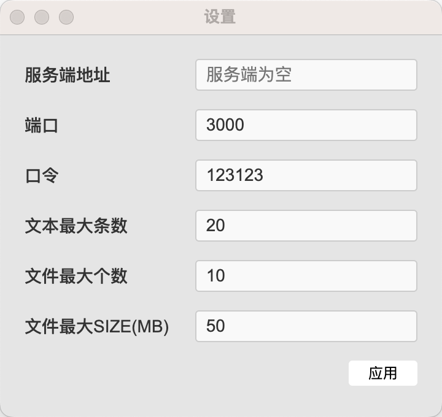

# 迷你保存(mini_save)

## 简介
实现跨端手机、window、mac剪切板共享，提高工作效率。

## 主要功能
- 共享剪切板
- 保存剪切板历史
- 跨端跨平台共享

## 自主编译
### 构建h5
- cd client
- npm i
- npm run build

### 构建应用（exe/dmg）
- npm i
- npm run package
- 产物在build-output目录

node >= 18

## 下载与安装
[安装包](https://github.com/iamtang/mini_save/releases/)

## 配置与使用

1. 运行后打开【设置】
2. 服务端可以无需动配置
3. 客户端要设置服务端的地址，其他不动
4. 口令相同的才会共享剪切板，所以可以实现AB之间共享，CD之间共享，AC之间不共享

## 移动端

> 因为移动端不支持后台读取剪切板，所以无法app实现，只能依靠h5页面
> 输入对应的口令，点击所需的内容复制或下载保存

